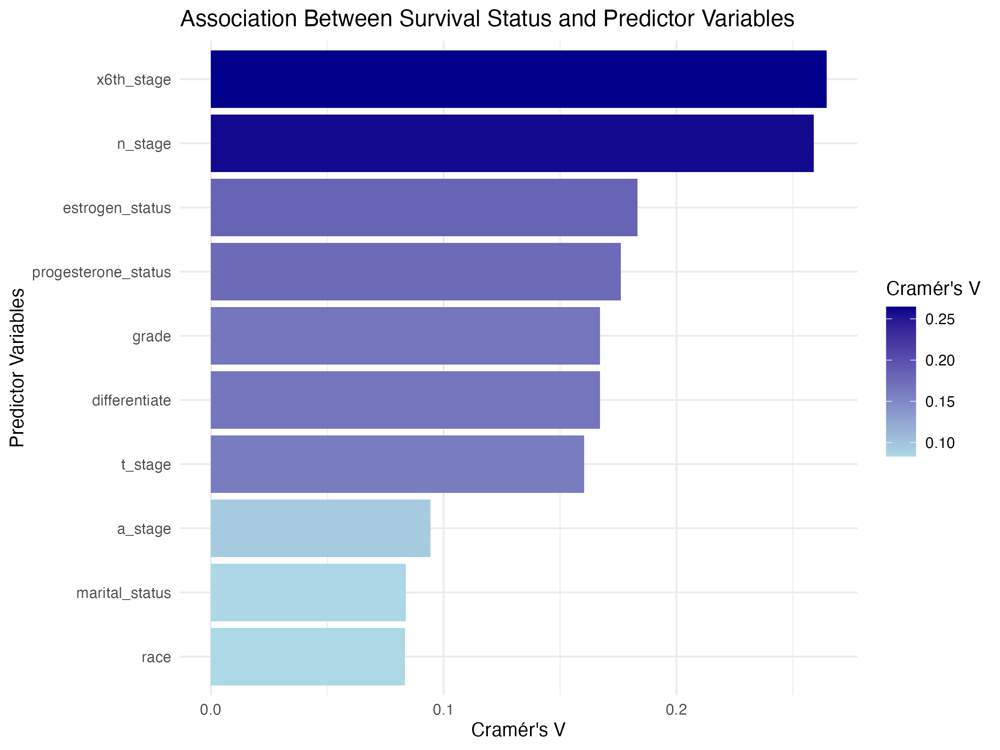
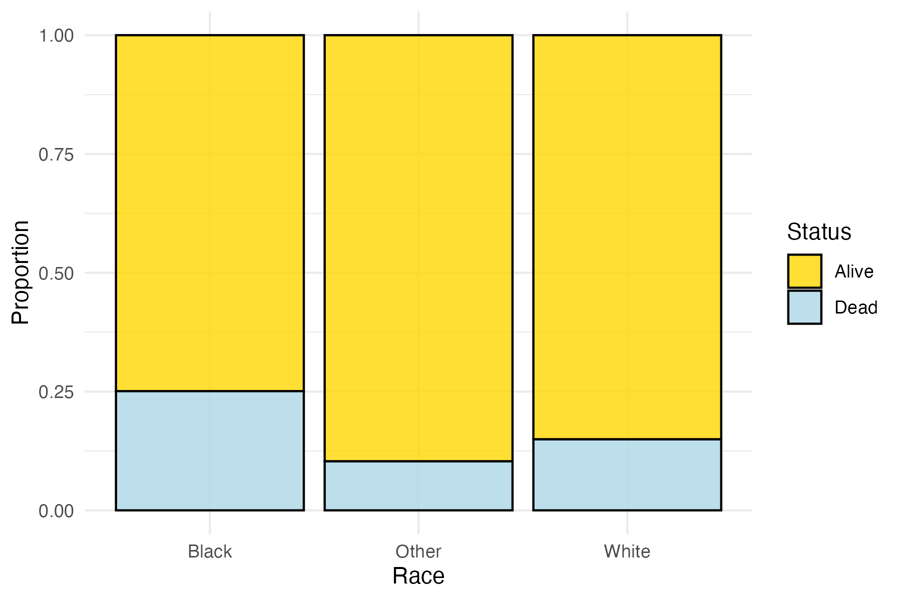
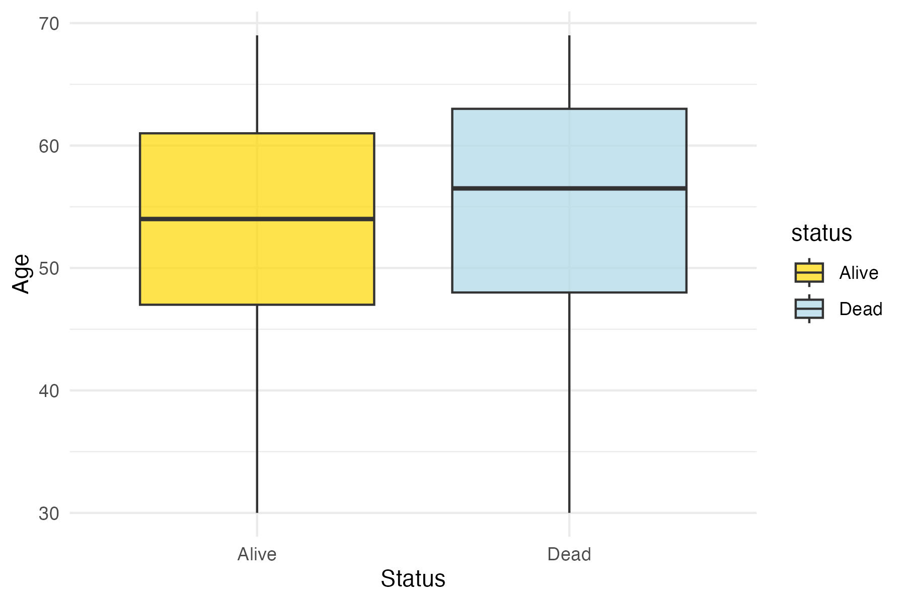
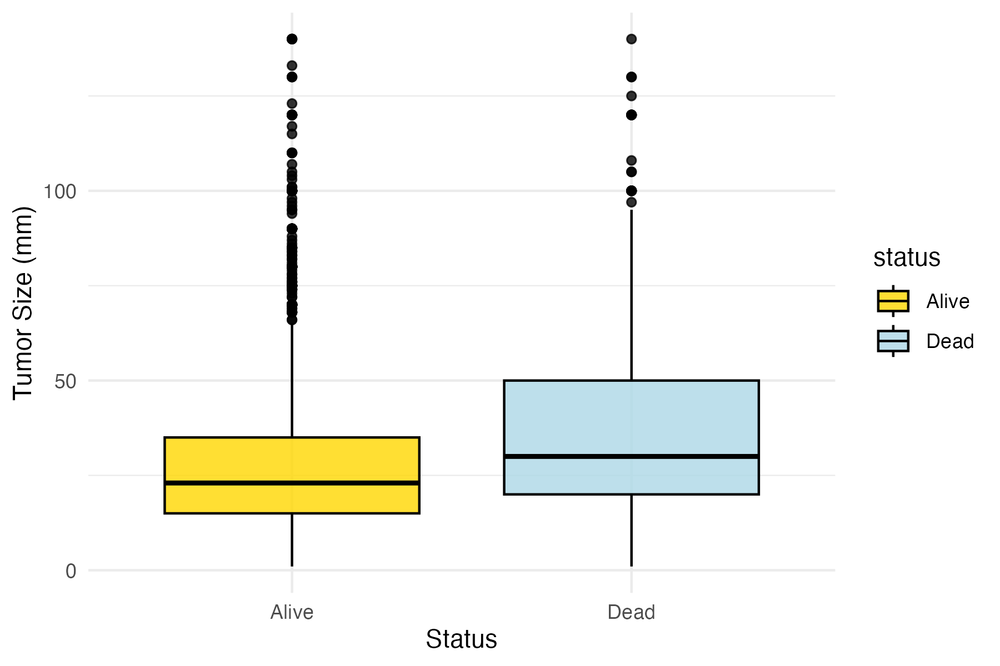
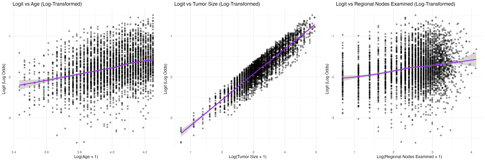
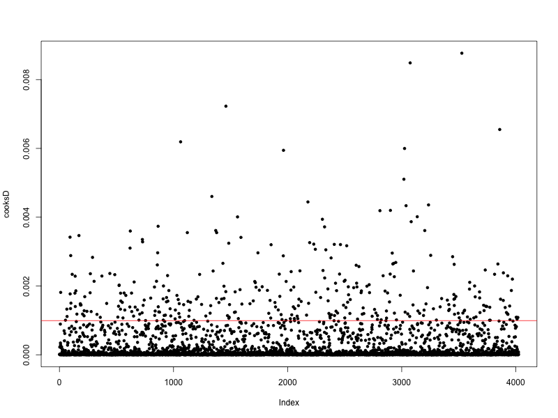

```{r setup, include=FALSE}
knitr::opts_chunk$set(echo = TRUE)
library(tidyverse)
library(janitor)
library(skimr)
library(dplyr)
library(ggplot2)
library(caret)
library(corrplot)
library(lsr)
library(vcd)
library(car)
library(gridExtra)
library(robustbase)
library(leaps)
library(pROC)
library(knitr)
```

## Abstract
Breast cancer is a leading cause of cancer-related mortality among women worldwide. This study develops a predictive model for survival outcomes in breast cancer patients using logistic regression, leveraging demographic, clinical, and pathological factors from a prospective cohort dataset. The analysis focuses on identifying key predictors of mortality, evaluating model performance across racial groups, and addressing fairness in prediction accuracy. Tumor stage, grade, and hormone receptor status emerged as significant predictors. The initial logistic regression model achieved a moderate performance, with an area under the receiver operating characteristic curve (ROC-AUC) of 0.74. However, disparities in model performance were observed between racial groups, prompting the implementation of reweighting strategies to enhance fairness. These findings highlight the importance of equitable modeling approaches to improve prognostic accuracy and clinical outcomes in breast cancer care.  

## Data Cleaning and Preprocessing

```{r data import and initial tidy, include = FALSE}
# Import data and clean column names
data <- read.csv("./data/Project_2_data.csv") %>% 
  clean_names()

# Select relevant covariates (variables 1-14) and outcome variable
model_data <- data %>%
  dplyr::select(-survival_months)

# Convert categorical variables to factors and relabel `grade`
model_data <- model_data %>%
  mutate(
    race = factor(race),
    marital_status = factor(marital_status),
    t_stage = factor(t_stage),
    n_stage = factor(n_stage),
    x6th_stage = factor(x6th_stage),
    differentiate = factor(differentiate),
    a_stage = factor(a_stage),
    estrogen_status = factor(estrogen_status),
    progesterone_status = factor(progesterone_status),
    status = factor(status, levels = c("Alive", "Dead")),
    grade = case_when(
      grade == "1" ~ "1",
      grade == "2" ~ "2",
      grade == "3" ~ "3",
      grade == " anaplastic; Grade IV" ~ "4",
      TRUE ~ NA_character_
    ) %>% factor(levels = c("1", "2", "3", "4"))
  )

# Summarize structure of the cleaned dataset
summary(model_data)
```

## Exploratory Data Analysis

### Summary statistics

```{r Summary statistics, echo = FALSE}
# Summary statistics for continuous and categorical variables
skimmed_data <- skim(model_data)

skim_categorical <- skimmed_data %>%
  filter(skim_type == "factor") %>%
  select(-starts_with("numeric"), -skim_type) %>%
  na.omit()
write.csv(skim_categorical, "tables/skim_categorical_summary.csv", row.names = FALSE)

skim_numeric <- skimmed_data %>%
  filter(skim_type == "numeric") %>%
  select(-starts_with("factor"), -skim_type) %>%
  na.omit()
colnames(skim_numeric) <- gsub("^numeric\\.", "", colnames(skim_numeric))
write.csv(skim_numeric, "tables/skim_numeric_summary.csv", row.names = FALSE)

# Key statistics grouped by survival status
summary_by_status <- model_data %>%
  group_by(status) %>%
  summarise(
    mean_age = mean(age, na.rm = TRUE),
    sd_age = sd(age, na.rm = TRUE),
    mean_tumor_size = mean(tumor_size, na.rm = TRUE),
    sd_tumor_size = sd(tumor_size, na.rm = TRUE),
    prop_white = mean(race == "White", na.rm = TRUE),
    prop_black_other = mean(race != "White", na.rm = TRUE),
    n_obs = n()
  )

write.csv(summary_by_status, "tables/summary_by_status.csv", row.names = FALSE)
```

### Distribution Visualization

#### Categorical Variables

Our modified dataset contains **10 categorical variables**:

\- **race**: Patient’s race (Black, White, Other).

\- **marital_status**: Patient’s marital status (Divorced, Married,
Separated, Single, Widowed).

\- **t_stage**: Tumor stage (T1, T2, T3, T4). ("T" refers to the size of
the primary tumor)

\- **n_stage**: Lymph node stage (N1, N2, N3). (extent of cancer spread
to nearby lymph nodes)

\- **x6th_stage**: Adjusted AJCC 6th stage (IIA, IIB, IIIA, IIIB, IIIC).

\- **differentiate**: Tumor differentiation (Well, Moderately, Poorly,
Undifferentiated). - **grade**: Grade of the tumor (1–4).

\- **a_stage**: Tumor spread stage (Regional, Distant).

\- **estrogen_status**: Estrogen receptor status (Positive, Negative).

\- **progesterone_status**: Progesterone receptor status (Positive,
Negative).

To examine the association of these variables with the binary outcome
`status` (Alive/Dead), I used **Cramér's V**, which quantifies the
strength of the association between two categorical variables based on
the Chi-Square statistic. Cramér's V ranges from **0** (no association)
to **1** (perfect association). This method helps identify the
predictors most strongly associated with survival status, enabling us to
prioritize variables for modeling.

```{r categorical varibales, echo = FALSE, warning =FALSE}
# Define categorical variables to analyze
variables <- c("race", "marital_status", "t_stage", "n_stage", "x6th_stage", 
               "differentiate", "grade", "a_stage", "estrogen_status", "progesterone_status")

# Initialize a vector to store Cramér's V results
results <- numeric(length(variables))

# Calculate Cramér's V for each variable
for (i in seq_along(variables)) {
  var <- variables[i]
  
  # Select outcome and predictor variable, omitting missing values
  df_temp <- model_data %>%
    dplyr::select(status, all_of(var)) %>%
    na.omit()
   
  # Convert both columns to factors
  x <- droplevels(as.factor(df_temp$status))
  y <- droplevels(as.factor(df_temp[[var]]))
  
  # Create contingency table and calculate Cramér's V
  table_var <- table(x, y)
  results[i] <- cramersV(table_var)
}

# Create a dataframe with results
association_df <- data.frame(Variable = variables, CramersV = results)

# Plot Cramér's V values
cramerV_association <- ggplot(association_df, aes(x = reorder(Variable, CramersV), y = CramersV, fill = CramersV)) +
  geom_bar(stat = "identity") +
  coord_flip() +
  scale_fill_gradient(low = "lightblue", high = "darkblue") +
  labs(
    title = "Association Between Survival Status and Predictor Variables",
    x = "Predictor Variables",
    y = "Cramér's V",
    fill = "Cramér's V"
  ) +
  theme_minimal()

ggsave("plots/cramerV_association.png", plot = cramerV_association, width = 8, height = 6)
```

The plot shows the strength of association (Cramér’s V) between
**survival status** and each categorical predictor:

1.  **x6th_stage** and **n_stage** have the **highest Cramér's V
    values** (around 0.25), indicating they are the most informative
    predictors of survival status in the dataset. These variables
    reflect tumor stage and lymph node involvement, which are critical
    factors in breast cancer prognosis.

2.  **Estrogen_status**, **progesterone_status**, and **grade** exhibit
    **moderate associations** (Cramér’s V around 0.15–0.2). These
    variables provide meaningful information about hormone status and
    differentiation, making them important contributors to survival
    prediction.

3.  **Differentiate** and **t_stage** show moderate but slightly lower
    associations compared to the top variables, suggesting their
    relevance to survival status.

4.  **a_stage**, **marital_status**, and **race** have **lower Cramér’s
    V values** (less than 0.1), indicating weaker associations with
    survival status. Although these variables contribute limited
    information individually, they may still be useful in interaction
    terms or when combined with other predictors.

By focusing on variables with higher Cramér’s V values, we can build
more efficient and predictive models for survival status analysis.

```{r race, echo = FALSE}
# Proportional Bar Plot for Survival Status by Race
race_barplot <- ggplot(model_data, aes(x = race, fill = status)) +
  geom_bar(position = "fill", alpha = 0.8, color = "black") +
  scale_fill_manual(values = c("Alive" = "gold", "Dead" = "lightblue")) +
  theme_minimal() +
  labs(
    x = "Race",
    y = "Proportion",
    fill = "Status"
  )

ggsave("plots/race_proportional_barplot.png", plot = race_barplot, width = 6, height = 4)


# Combine "Black" and "Other" into a single group "Minority Non-White"
model_data_race_combined <- model_data %>%
  mutate(
    race_combined = case_when(
      race == "White" ~ "Majority White",
      race %in% c("Black", "Other") ~ "Minority Non-White"
    ),
    race_combined = factor(race_combined, levels = c("Majority White", "Minority Non-White"))
  )

# Proportional Bar Plot for Combined Race Groups
race_combined_barplot <- ggplot(model_data_race_combined, aes(x = race_combined, fill = status)) +
  geom_bar(position = "fill", alpha = 0.8, color = "black") +
  scale_fill_manual(values = c("Alive" = "gold", "Dead" = "lightblue")) +
  theme_minimal() +
  labs(
    x = "Race Group",
    y = "Proportion",
    fill = "Status"
  )

ggsave("plots/race_combined_proportional_barplot.png", plot = race_combined_barplot, width = 6, height = 4)
```

Both plots confirm a disparity in survival outcomes across racial
groups. Non-White patients, particularly Black patients, show a higher
likelihood of death. Effect of Combining Groups: Combining Black and
Other into Minority Non-White simplifies the comparison and reduce the
racial disparities between Majority White and Minority Non-White groups.

#### Continuous Variables

```{r continuous variables, include = FALSE}
continuous_vars <- model_data %>%
  dplyr::select(age, tumor_size, regional_node_examined, reginol_node_positive) %>%
  na.omit()

df1 <- as.data.frame(continuous_vars)

hist_list <- lapply(names(continuous_vars), function(col) {
  ggplot(continuous_vars, aes_string(x = col)) +
    geom_histogram(fill = "beige", color = "black", bins = 30) +
    labs(
      title = paste("Histogram of", col),
      x = col,
      y = "Frequency"
    ) +
    theme_minimal()
})

# Arrange plots in a grid
hist_grid <- marrangeGrob(hist_list, nrow = 1, ncol = 4)
ggsave("plots/original_histograms_grid.png", hist_grid, width = 16, height = 4)
```

Histograms were created for each continuous variable to visually examine
their distributions and identify potential skewness. The results
revealed that, except for `age`, the other three variables exhibited
significant right skewness, indicating the need for transformation if we
want to perform linear regression. Though we are not doing linear
regression, transformation has still been performed here, we see that
after performing log-transformation, there is a improvement on the
skewness of `tumor_size`, `regional_node_examined` and
`reginol_node_positive`.

```{r transformation, include = FALSE}
df_log <- df1 %>%
  dplyr::select(-tumor_size, -regional_node_examined, -reginol_node_positive) %>%
  mutate(
    tumor_size_log = log(df1$tumor_size + 1),
    rn_examined_log = log(df1$regional_node_examined + 1),
    rn_positive_log = log(df1$reginol_node_positive + 1)
  )

log_hist_list <- lapply(names(df_log), function(col) {
  ggplot(df_log, aes_string(x = col)) +
    geom_histogram(fill = "beige", color = "black", bins = 30) +
    labs(
      title = paste("Histogram of", col, "(Log Transformed)"),
      x = col,
      y = "Frequency"
    ) +
    theme_minimal()
})

# Arrange plots in a grid
log_hist_grid <- marrangeGrob(log_hist_list, nrow = 1, ncol = 4)
ggsave("plots/log_transformed_histograms_grid.png", log_hist_grid, width = 16, height = 4)
```

Boxplots were then generated for each continuous variable stratified by
survival status to visually assess their relationships with the binary
outcome.

```{r age, include = FALSE}
# Age by survival status
age_boxplot <- ggplot(model_data, aes(x = status, y = age, fill = status)) +
  geom_boxplot(alpha = 0.7) +
  scale_fill_manual(values = c("Alive" = "gold", "Dead" = "lightblue")) +
  theme_minimal() +
  labs(
    x = "Status",
    y = "Age"
  )

ggsave("plots/age_by_status_boxplot.png", plot = age_boxplot, width = 6, height = 4)
```

```{r tumor size, include = FALSE}
# Tumor size by survival status
tumor_boxplot <- ggplot(model_data, aes(x = status, y = tumor_size, fill = status)) +
  geom_boxplot(alpha = 0.8, color = "black") +
  scale_fill_manual(values = c("Alive" = "gold", "Dead" = "lightblue")) +
  theme_minimal() +
  labs(
    x = "Status",
    y = "Tumor Size (mm)"
  )

ggsave("plots/tumor_size_by_status_boxplot.png", plot = tumor_boxplot, width = 6, height = 4)

# Tumor size by race and survival status
tumor_race_boxplot <- ggplot(model_data, aes(x = race, y = tumor_size, fill = status)) +
  geom_boxplot(alpha = 0.8, color = "black") +
  scale_fill_manual(values = c("Alive" = "gold", "Dead" = "lightblue")) +
  theme_minimal() +
  labs(
    x = "Race",
    y = "Tumor Size (mm)"
  )

ggsave("plots/tumor_size_by_race_status_boxplot.png", plot = tumor_race_boxplot, width = 6, height = 4)
```

```{r rn_examined, include = FALSE}
# Regional Node Examined by survival status
rn_examined_boxplot <- ggplot(model_data, aes(x = status, y = regional_node_examined, fill = status)) +
  geom_boxplot(alpha = 0.7) +
  scale_fill_manual(values = c("Alive" = "gold", "Dead" = "lightblue")) +
  theme_minimal() +
  labs(
    x = "Status",
    y = "regional_node_examined"
  )

ggsave("plots/rn_examined_by_status_boxplot.png", plot = rn_examined_boxplot, width = 6, height = 4)

```

```{r rn_positive, include = FALSE}
# Reginol Node Positive by survival status
rn_positive_boxplot <- ggplot(model_data, aes(x = status, y = reginol_node_positive, fill = status)) +
  geom_boxplot(alpha = 0.7) +
  scale_fill_manual(values = c("Alive" = "gold", "Dead" = "lightblue")) +
  theme_minimal() +
  labs(
    x = "Status",
    y = "regional_node_positive"
  )

ggsave("plots/rn_positive_by_status_boxplot.png", plot = rn_positive_boxplot, width = 6, height = 4)
```

### Pairwise Relationships and Interactions

```{r pairwise, include = FALSE}
correlation_matrix <- cor(continuous_vars, use = "pairwise.complete.obs")

# Pairwise relationships (correlation matrix for continuous variables)
correlation_plot <- function() {
  corrplot(
    correlation_matrix,
    method = "circle",
    type = "upper",
    tl.col = "black",
    addCoef.col = "grey",
    number.cex = 0.8,
    tl.cex = 0.9
  )
}

png("plots/correlation_matrix_plot.png", width = 800, height = 600)
correlation_plot()
dev.off()
```

A correlation matrix was generated to examine the relationships between
the variables. Small circles (near-zero correlations) are observed for
age and all other variables; tumor_size and regional_node_examined
suggesting weak or no relationships. `regional_node_positive` is
moderately associated with both `tumor size` (0.24) and
`regional nodes examined` (0.41), which might influence modeling
decisions. There are no strong correlations (close to +-1), suggesting
no immediate multicollinearity issues among these variables.

## Modeling - Logistic Regression

Since the outcome is Binary (e.g., Alive/Dead), We decide to proceed
with logistic regression instead of linear regression. Logistic
regression outputs odds ratios, which are more interpretable for binary
classification problems. For example, it tells you how much the odds of
death increase with a unit increase in a predictor.

### Checking Assumptions and Transformations

#### Binary or Dichotomous Response Variable

```{r binary response, include = FALSE}
unique(model_data$status)
```

The response variable (status) has exactly two categories: Alive and
Dead.

#### No Multicollinearity

```{r multicollinearity1, echo = FALSE}
# Fit an initial logistic regression model
model_data_1 <- model_data %>%
  mutate(
    race = relevel(race, ref = "White"),  # Set "White" as reference
    grade = relevel(grade, ref = "1"),    # Set "Grade 1" as reference
    x6th_stage = relevel(x6th_stage, ref = "IIA") # Set "IIA" as reference
  )

alias_results <- capture.output(alias(glm(status ~ ., data = model_data_1, family = binomial)))

# Save the results to a text file in the `results` folder
writeLines(alias_results, "results/alias_results_model1.txt")
```

From the alias() output: grade2, grade3, and grade4 are collinear with
other predictors. x6th_stageIIIC is collinear with n_stage or other
levels of x6th_stage. differentiate levels also overlap in prediction
with grade.

Given that both `x6th_stage` and `n_stage` are strong predictors, with
`x6th_stage` showing a slightly higher association, `n_stage` can be
dropped as its information is already captured by `x6th_stage`.
Similarly, `t_stage`, which is related to tumor size, can also be
removed to avoid redundancy. The variable `differentiate` can be
excluded as well, as it overlaps with `grade`, with both variables
reflecting tumor differentiation. In the context of breast cancer,
"regional node positive" indicates the presence of cancer cells in
nearby lymph nodes, while "regional node examined" refers to the
surgical removal and analysis of these nodes to determine cancer spread.
From the previous correlation matrix, `regional_node_positive` shows a
moderate association with both `tumor size` (0.24) and
`regional_node_examined` (0.41), suggesting some redundancy. To simplify
the model and minimize multicollinearity, we choose to drop
`regional_node_positive`.

```{r multicollinearity2, echo = FALSE}
model_data_2 <- model_data_1 %>%
  dplyr::select(-differentiate, -n_stage, -t_stage, -reginol_node_positive)

# Perform multicollinearity check with alias()
alias_results_2 <- capture.output(alias(glm(status ~ ., data = model_data_2, family = binomial)))
writeLines(alias_results_2, "results/alias_results_model2.txt")

# Fit a logistic regression model
model_vif <- glm(status ~ ., data = model_data_2, family = binomial)

# Calculate VIF
vif_values <- vif(model_vif)
vif_df <- as.data.frame(vif_values)
vif_df <- tibble::rownames_to_column(vif_df, var = "Variable")
colnames(vif_df) <- c("Variable", "GVIF", "Df", "GVIF_Ratio")
write.csv(vif_df, "tables/vif.csv", row.names = FALSE)
```

The results show that all VIF values are below 5, which indicates that
multicollinearity is no longer a concern in your logistic regression
model.

#### Linear Relationship to Log Odds

```{r Log Odds, include = FALSE, message = FALSE}
continuous_vars_log_odds <- model_data_2 %>%
  dplyr::select(age, tumor_size, regional_node_examined, status) %>%  # Include 'status'
  na.omit()

# Log-transform tumor size and regional nodes examined
df_log_odds <- continuous_vars_log_odds %>%
  mutate(
    age_log = log(age + 1),
    tumor_size_log = log(tumor_size + 1),
    rn_examined_log = log(regional_node_examined + 1)
  )

linearity_test <- glm(status ~ age_log + tumor_size_log + rn_examined_log, 
                      data = df_log_odds, 
                      family = binomial)

df_log_odds$logit <- predict(linearity_test, type = "link") 


plot1 <- ggplot(df_log_odds, aes(x = age_log, y = logit)) +
  geom_point(alpha = 0.4) +
  geom_smooth(method = "loess", color = "purple") +
  labs(title = "Logit vs Age (Log-Transformed)", 
       x = "Log(Age + 1)", y = "Logit (Log Odds)") +
  theme_minimal()

plot2 <- ggplot(df_log_odds, aes(x = tumor_size_log, y = logit)) +
  geom_point(alpha = 0.4) +
  geom_smooth(method = "loess", color = "purple") +
  labs(title = "Logit vs Tumor Size (Log-Transformed)", x = "Log(Tumor Size + 1)", y = "Logit (Log Odds)") +
  theme_minimal()

plot3 <- ggplot(df_log_odds, aes(x = rn_examined_log, y = logit)) +
  geom_point(alpha = 0.4) +
  geom_smooth(method = "loess", color = "purple") +
  labs(title = "Logit vs Regional Nodes Examined (Log-Transformed)", 
       x = "Log(Regional Nodes Examined + 1)", y = "Logit (Log Odds)") +
  theme_minimal()

log_odds_grid <- grid.arrange(plot1, plot2, plot3, ncol = 3)
ggsave("plots/logit_grid_plot.png", plot = log_odds_grid, width = 18, height = 6)

# Update
model_data_3 <- model_data_2 %>%
  mutate(
    tumor_size_log = log(tumor_size + 1),
    rn_examined_log = log(regional_node_examined + 1),
    age_log = log(age + 1)
  ) %>%
  dplyr::select(-tumor_size, -regional_node_examined, -age) 
```

From the plot, we see that there's a linear relationship between
continuous predictors (log transformed) and the log odds of the outcome.

#### No Extreme Outliers

```{r outliers1, include = FALSE}
# Fit logistic regression model with log-transformed predictors
full_model <- glm(status ~ ., 
                 data = model_data_3, family = binomial)

# Calculate Cook's Distance
cooksD <- cooks.distance(model_vif)

# Plot Cook's Distance
png("plots/cooks_distance_plot.png", width = 800, height = 600)
plot(cooksD, pch = 20)
abline(h = 4 / nrow(model_data_3), col = "red")
dev.off()

# Identify influential observations
influential_obs <- which(cooksD > 4 / nrow(model_data_3))

# Build Model
model_no_outliers <- glm(status ~ ., 
                         data = model_data_3[-influential_obs, ], family = binomial)

model_robust <- glmrob(status ~ .,
                       data = model_data_3, family = binomial, method = "Mqle")

# Extract summaries
full_coefficients <- summary(full_model)$coefficients
no_outliers_coefficients <- summary(model_no_outliers)$coefficients
robust_coefficients <- summary(model_robust)$coefficients

# Identify unstable coefficients
unstable_coeffs <- which(
  (abs(full_coefficients[, "Estimate"] - no_outliers_coefficients[, "Estimate"]) > 2) |
  (abs(full_coefficients[, "Std. Error"] - no_outliers_coefficients[, "Std. Error"]) > 2)
)
unstable_coeffs_df <- data.frame(
  Variable = rownames(full_coefficients)[unstable_coeffs],
  Full_Model_Coefficient = full_coefficients[unstable_coeffs, "Estimate"],
  Full_Model_SE = full_coefficients[unstable_coeffs, "Std. Error"],
  No_Outliers_Coefficient = no_outliers_coefficients[unstable_coeffs, "Estimate"],
  No_Outliers_SE = no_outliers_coefficients[unstable_coeffs, "Std. Error"],
  Robust_Coefficient = robust_coefficients[rownames(full_coefficients)[unstable_coeffs], "Estimate"],
  Robust_SE = robust_coefficients[rownames(full_coefficients)[unstable_coeffs], "Std. Error"]
)

write.csv(unstable_coeffs_df, "tables/unstable_coefficients.csv", row.names = FALSE)
```

```{r outliers2, echo = FALSE}
# Extract robustness weights
robust_summary <- capture.output(summary(model_robust))
start_line <- grep("Robustness weights w.r \\* w.x:", robust_summary)
end_line <- start_line + 5
desired_section <- robust_summary[start_line:end_line]
cat(paste(desired_section, collapse = "\n"))
```

In large datasets, Cook's Distance can flag numerous observations as
influential, often due to large sample size. These flagged points may
represent true variability in the population rather than errors. The
code results indicate that removing influential points harms the model,
likely by disrupting essential data structure. Coefficients for
variables like `grade` and intercept became unstable and unreliable,
with extreme standard errors.

In contrast, the robust logistic regression (`model_robust`) provided
stable and reliable estimates while effectively mitigating the impact of
influential observations. Key predictors, such as `age_log`,
`rn_examined_log`, `grade`, `x6th_stage`, and `race`, retained
coefficients similar to the standard logistic regression. The robustness
weights further show that about 12% of the data (478 out of 4024
observations) had reduced influence, while the majority (\~88%, or 3546
observations) remained largely unaffected with weights close to 1. This
approach accounts for influential points by down-weighting their impact,
ensuring the model is less sensitive to extreme values without the need
to remove data.

While both original and robust logistic regression are viable options
for future analysis, we will proceed with the original logistic
regression due to our limited familiarity with robust logistic
regression techniques

#### Independence of Errors

Since there are no group IDs, the independence assumption is satisfied.

### Model Evaluation and Selection

We use original Logistic Regression as the primary models, considering
its earlier performance.

```{r variable selection original 1, echo = FALSE}
# Forward selection
forward_model <- step(glm(status ~ ., data = model_data_3, family = binomial), scope = list(lower = ~1, upper = full_model), direction = "forward", trace = 0)

# Backward elimination
backward_model <- step(glm(status ~ ., data = model_data_3, family = binomial), direction = "backward", trace = 0)

# Stepwise selection
stepwise_model <- step(glm(status ~ ., data = model_data_3, family = binomial), scope = list(lower = ~1, upper = full_model), direction = "both", trace = 0)

writeLines(capture.output(summary(full_model)), "results/full_model_summary.txt")
writeLines(capture.output(summary(forward_model)), "results/forward_model_summary.txt")
writeLines(capture.output(summary(backward_model)), "results/backward_model_summary.txt")
writeLines(capture.output(summary(stepwise_model)), "results/stepwise_model_summary.txt")
```

full results are attached in the end Full Model: glm(formula = status \~
. , family = binomial, data = model_data_3) AIC: 3039.8

Forward Model glm(formula = status \~ race + marital_status +
x6th_stage + grade + a_stage + estrogen_status + progesterone_status +
tumor_size_log + rn_examined_log + age_log, family = binomial, data =
model_data_3) AIC: 3039.8

Backward Model: glm(formula = status \~ race + marital_status +
x6th_stage + grade + estrogen_status + progesterone_status +
rn_examined_log + age_log, family = binomial, data = model_data_3)
AIC:3037.5

Stepwise Model: glm(formula = status \~ race + marital_status +
x6th_stage + grade + estrogen_status + progesterone_status +
rn_examined_log + age_log, family = binomial, data = model_data_3)
AIC:3037.5

```{r best subset-original 1, echo = FALSE}
best_subset <- regsubsets(`status` ~ ., data = model_data_3, nvmax = ncol(model_data_3) - 1)
best_summary <- summary(best_subset)

subset_table <- data.frame(
  Num_Predictors = 1:length(best_summary$adjr2),
  Adj_R2 = best_summary$adjr2,
  Cp = best_summary$cp,
  BIC = best_summary$bic
)
write.csv(subset_table, "tables/best_subset_summary.csv", row.names = FALSE)

best_adjr2_model <- which.max(best_summary$adjr2)
adjr2_predictor <- names(coef(best_subset, best_adjr2_model))[-1]
best_cp_model <-  which.min(best_summary$cp)
cp_predictor <- names(coef(best_subset, best_cp_model))[-1]
best_bic_model <- which.min(best_summary$bic)
bic_predictor <- names(coef(best_subset, best_bic_model))[-1]

cat("Best Model by Adjusted R2: ", best_adjr2_model, "variables,", adjr2_predictor, "\n")
cat("Best Model by Cp: ", best_cp_model, "variables,", cp_predictor, "\n")
cat("Best Model by BIC: ", best_bic_model, "variables,", bic_predictor, "\n")
```

```{r best subset-original 2, include = FALSE}
png("plots/best_subset_plots.png", width = 1800, height = 600, res = 150)
par(mfrow = c(1, 3))
plot(best_summary$adjr2, 
     type = "b", 
     main = "Adjusted R² vs Model Size", 
     xlab = "Number of Variables", 
     ylab = "Adjusted R²")
plot(best_summary$cp, 
     type = "b", 
     main = "Cp vs Model Size", 
     xlab = "Number of Variables", 
     ylab = "Cp")
plot(best_summary$bic, 
     type = "b", 
     main = "BIC vs Model Size", 
     xlab = "Number of Variables", 
     ylab = "BIC")
par(mfrow = c(1, 1))
dev.off()
```

```{r interacting effects, echo = FALSE}
# Define predictors
predictors <- c("race", "marital_status", "x6th_stage", "grade", 
                "estrogen_status", "progesterone_status", "rn_examined_log", "age_log")

# Create a dataframe to store results
interaction_results <- data.frame(
  Predictor1 = character(),
  Predictor2 = character(),
  P_Value = numeric(),
  stringsAsFactors = FALSE
)

# Loop through each pair of predictors
for (i in seq_along(predictors)) {
  for (j in seq_along(predictors)) {
    if (i < j) {
      predictor1 <- predictors[i]
      predictor2 <- predictors[j]
      
      # Fit interaction model
      formula <- as.formula(paste("status ~", paste(predictors, collapse = " + "), 
                                  "+", predictor1, "*", predictor2))
      interaction_model <- glm(formula, family = binomial, data = model_data_3)
      
      # Extract interaction term
      interaction_term <- paste(predictor1, predictor2, sep = ":")
      coef_names <- names(coef(interaction_model))
      
      if (interaction_term %in% coef_names) {
        # Extract p-value for the interaction term
        p_value <- coef(summary(interaction_model))[interaction_term, "Pr(>|z|)"]
        
        # Append to results if p-value < 0.05
        if (p_value < 0.05) {
          interaction_results <- rbind(interaction_results, 
                                       data.frame(Predictor1 = predictor1, 
                                                  Predictor2 = predictor2, 
                                                  P_Value = p_value, 
                                                  stringsAsFactors = FALSE))
        }
      }
    }
  }
}

# Sort results by p-value
interaction_results <- interaction_results[order(interaction_results$P_Value), ]
print(interaction_results)
```

Since resulting dataframe is empty, it suggests that none of the
interaction terms tested in our dataset have p-values less than 0.05.
This outcome aligns with our earlier exploratory analyses (Cramér’s V,
correlation matrix, and model diagnostics), which indicated that
interaction effects are likely weak or non-existent in your data.

#### Final Model

Since Best subset selection evaluates all possible combinations of
predictors (including all levels of factor variables) to find the model
with the best fit according to criteria like adjusted R2, Cp and BIC,
each level of a factor variable (e.g., x6th_stageIIIA) can be treated as
an independent binary variable (dummy variable) in this process. Thus we
will not use the best subset selection , as we need consider the factor
as a whole for interpretability.

The final model was chosen through forward, backward, and stepwise
selection methods using AIC as the selection criterion. The model
balances interpretability and predictive performance, including only
significant predictors that contribute to understanding survival
outcomes:

`glm(formula = status ~ race + marital_status + x6th_stage + grade + estrogen_status + progesterone_status + rn_examined_log + age_log, family = binomial, data = model_data_3)`

In logistic regression, coefficients represent the change in the
log-odds of the outcome (`status` = Dead) for a one-unit increase in a
predictor, holding other variables constant. Odds ratios provide a more
interpretable measure.

The key coefficients included are 1. Race: - raceBlack: Positive
coefficient implies higher odds of death for Black patients compared to
the reference group (White patients). Odds ratio \> 1 indicates
increased risk for Black patients. - raceOther: Negative coefficient
indicates slightly reduced odds of death for patients classified as
"Other" compared to White patients.

2.  Marital Status: The marital status categories have weak effects
    (some not statistically significant). For instance, being married or
    widowed appears to have no strong association with survival compared
    to the reference group.

3.  Adjusted AJCC 6th stage (`x6th_stage`): is the strongest predictor
    of death risk. Higher stages (IIIA, IIIB, IIIC) significantly
    increase the odds of death compared to stage IIA (reference group).
    Patients in stage IIIC have the highest odds of death, indicating
    advanced tumor progression is a critical predictor of survival.

4.  Tumor Grade (`grade`): Grades 3 and 4 significantly increase the
    odds of death compared to Grade 1, indicating poorly differentiated
    tumors are associated with worse outcomes.

5.  Hormone Receptor Status: `estrogen_statusPositive` and
    `progesterone_statusPositive`: Negative coefficients suggest reduced
    odds of death for patients with positive estrogen or progesterone
    receptor status. This reflects the improved prognosis often
    associated with hormone-sensitive tumors.

6.  Log-transformed Predictors: -`rn_examined_log`: Negative coefficient
    indicates increased survival odds with more regional lymph nodes
    examined. This might reflect more aggressive or effective treatment
    strategies. -`age_log`: Positive coefficient implies older patients
    are at higher risk of death.

So `x6th_stage`, `grade`, `estrogen_statusPositive` and
`progesterone_statusPositive`, `age_log` and `rn_examined_log` are
significant predictors affecting the risk.

#### Model Performance

```{r performance, echo = FALSE}
set.seed(123)
control <- trainControl(method = "cv", number = 10, classProbs = TRUE, summaryFunction = twoClassSummary)

cv_model <- train(
  status ~ race + marital_status + x6th_stage + grade + estrogen_status + 
    progesterone_status + rn_examined_log + age_log,
  data = model_data_3,
  method = "glm",
  family = "binomial",
  trControl = control,
  metric = "ROC"
)

performance_summary <- capture.output(cv_model)
writeLines(performance_summary, "results/cv_model_performance.txt")
```

full results are attached in the end We did Cross-Validation (10 fold)
ROC-AUC: 0.7400, the overall performance of the model is moderately
good, with an acceptable ability to distinguish between "Alive" and
"Dead" outcomes. Sensitivity: 0.985, the model is highly sensitive,
meaning it correctly identifies most of the "Dead" cases. Specificity:
0.122, the model has very low specificity, indicating difficulty in
correctly identifying "Alive" cases.

```{r fairness, echo = FALSE, message = FALSE, warning = FALSE}
# Split data by race group
white_data <- model_data_3 %>% filter(race == "White")
minority_data <- model_data_3 %>% filter(race != "White")
black_data <- model_data_3 %>% filter(race == "Black")
other_data <- model_data_3 %>% filter(race == "Other")

# Predict probabilities for White group
pred_white <- predict(cv_model, newdata = white_data, type = "prob")[, "Dead"]
roc_white <- roc(white_data$status, pred_white)
auc_white <- auc(roc_white)

# Predict probabilities for Minority group
pred_minority <- predict(cv_model, newdata = minority_data, type = "prob")[, "Dead"]
roc_minority <- roc(minority_data$status, pred_minority)
auc_minority <- auc(roc_minority)

# Predict probabilities for Black group
pred_black <- predict(cv_model, newdata = black_data, type = "prob")[, "Dead"]
roc_black <- roc(black_data$status, pred_black)
auc_black <- auc(roc_black)

# Predict probabilities for Other group
pred_other <- predict(cv_model, newdata = other_data, type = "prob")[, "Dead"]
roc_other <- roc(other_data$status, pred_other)
auc_other <- auc(roc_other)

# Print AUC results
cat("ROC-AUC for White group:", auc_white, "\n")
cat("ROC-AUC for Black group:", auc_black, "\n")
cat("ROC-AUC for Other group:", auc_other, "\n")
cat("ROC-AUC for Minority group:", auc_minority, "\n")
```

Performance by Race Groups White Group (Majority): - ROC-AUC: 0.7504 -
The model performs better for the majority race group, achieving the
highest predictive ability among the subgroups.

Black Group (Minority): - ROC-AUC: 0.7021 - The performance for Black
patients is lower than for White patients, indicating potential
disparities in prediction accuracy.

Other Group (Minority): - ROC-AUC: 0.6584 - The lowest ROC-AUC is for
the "Other" race group, suggesting the model struggles most with this
subgroup.

Combined Minority Group (Black + Other): - ROC-AUC: 0.7313 - When
grouped together, the model's performance for minorities improves but
remains slightly lower than for the White group.

This disparity indicate a potential fairness issue, which need us to
reduce the performance gap.

```{r reweight subgroup, echo = FALSE, warning = FALSE, message = FALSE}
model_data_4 <- model_data_3 %>%
  mutate(weight = case_when(
    race == "White" ~ 1,
    race == "Black" ~ 1.5,
    race == "Other" ~ 2
  ))

minority_data <- model_data_4 %>% filter(race != "White")

# Refit the model with weights
reweighted_model <- train(
  status ~ race + marital_status + x6th_stage + grade + estrogen_status + 
    progesterone_status + rn_examined_log + age_log,
  data = model_data_4,
  method = "glm",
  family = "binomial",
  trControl = control,
  weights = weight
)

# Evaluate performance on subgroups
pred_white_weighted <- predict(reweighted_model, newdata = white_data, type = "prob")[, "Dead"]
roc_white_weighted <- roc(white_data$status, pred_white_weighted)
auc_white_weighted <- auc(roc_white_weighted)

pred_minority_weighted <- predict(reweighted_model, newdata = minority_data, type = "prob")[, "Dead"]
roc_minority_weighted <- roc(minority_data$status, pred_minority_weighted)
auc_minority_weighted <- auc(roc_minority_weighted)

pred_black_weighted <- predict(reweighted_model, newdata = black_data, type = "prob")[, "Dead"]
roc_black_weighted <- roc(black_data$status, pred_black_weighted)
auc_black_weighted <- auc(roc_black_weighted)

pred_other_weighted <- predict(reweighted_model, newdata = other_data, type = "prob")[, "Dead"]
roc_other_weighted <- roc(other_data$status, pred_other_weighted)
auc_other_weighted <- auc(roc_other_weighted)

# Print updated results
cat("Reweighted Model - ROC-AUC for White group:", auc_white_weighted, "\n")
cat("Reweighted Model - ROC-AUC for Minority group:", auc_minority_weighted, "\n")
cat("Reweighted Model - ROC-AUC for Black group:", auc_black_weighted, "\n")
cat("Reweighted Model - ROC-AUC for Other group:", auc_other_weighted, "\n")


```

The reweighted model shows improved fairness compared to the original
combined model: Reweighting has reduced the performance gap between the
White and minority groups. The ROC-AUC for the minority group (0.7358)
is now closer to that of the majority group (0.7486).

## Conclusion

### Table

```{r conclusion, echo = FALSE}
# Extract coefficients and confidence intervals from the reweighted model
summary_reweighted <- summary(reweighted_model$finalModel)
coefficients <- coef(summary_reweighted)

# Calculate Odds Ratios and 95% Confidence Intervals
odds_ratios <- exp(coefficients[, "Estimate"])
lower_ci <- exp(coefficients[, "Estimate"] - 1.96 * coefficients[, "Std. Error"])
upper_ci <- exp(coefficients[, "Estimate"] + 1.96 * coefficients[, "Std. Error"])

# Combine into a table
results_table <- data.frame(
  Predictor = rownames(coefficients),
  Estimate = round(coefficients[, "Estimate"], 3),
  Std_Error = round(coefficients[, "Std. Error"], 3),
  Odds_Ratio = round(odds_ratios, 3),
  `95% CI (Lower)` = round(lower_ci, 3),
  `95% CI (Upper)` = round(upper_ci, 3),
  `P-Value` = format.pval(coefficients[, "Pr(>|z|)"], digits = 3)
)

# Clean up row names
rownames(results_table) <- NULL

write.csv(results_table, "tables/reweighted_model_results.csv", row.names = FALSE)
```

### Finding and Intepretation

The final reweighted logistic regression model identifies significant
predictors of mortality risk (Alive vs Dead) for breast cancer patients.
The table above summarizes the parameter estimates, highlighting the
direction, magnitude, and significance of each predictor. The study
confirms that Adjusted AJCC 6th stage (`x6th_stage`) and `grade` (Grade
of the tumor) are the most critical factors in predicting mortality,
which is consistent with clinical guidelines. Hormone receptor status
also plays a vital role, as positive estrogen/progesterone receptors
improve survival. Race also significantly impacts mortality risk. Black
patients experience a higher risk of death compared to White patients.
This disparity may stem from differences in access to healthcare, late
diagnosis, or biological factors. The reweighted model successfully
improves fairness across racial groups while maintaining overall
predictive accuracy. Although the model performs slightly worse for
minority groups, the gap has been reduced compared to the original
model.

### Limitation

The model assumes no significant interaction effects, which aligns with the data but could miss complex relationships. The disparity in model performance for "Other" racial groups suggests the need for further data collection or alternative modeling techniques.

## Contribution
Ada Guo wrote the abstract and introduction, compiled data cleaning and EDA results, and synthesized findings into cohesive sections for the report. 
Khue Nguyen analyzed results, wrote the conclusion and limitations, refined the report structure, and ensured clarity and completeness by adding references.
Yixin Zheng wrote the methods and appendix section and constructed the Rmd file(cleaning, correlation matrix, Cramér's V, assumption checks, feature selection, model, cross-validation, fairness reweight).

## Reference


\newpage

## Table, Plots, and Code Results

### Tables

```{r table, echo=FALSE, eval=TRUE}
skim_categorical <- read.csv("tables/skim_categorical_summary.csv")
knitr::kable(skim_categorical, caption = "Skim Summary for Categorical Variables")

skim_numeric <- read.csv("tables/skim_numeric_summary.csv")
knitr::kable(skim_numeric, caption = "Skim Summary for Numeric Variables")

summary_by_status <- read.csv("tables/summary_by_status.csv")
knitr::kable(summary_by_status, caption = "Summary Statistics Grouped by Survival Status")

vif_table <- read.csv("tables/vif.csv")
knitr::kable(vif_table, caption = "Variance Inflation Factors for Predictors")

best_subset_summary <- read.csv("tables/best_subset_summary.csv")
knitr::kable(best_subset_summary, caption = "Best Subset Selection Summary")

reweighted_model_results <- read.csv("tables/reweighted_model_results.csv")
knitr::kable(reweighted_model_results, caption = "Reweighted Logistic Regression Model Results")
```

\newpage

### Plots
















\newpage

### Code Results

For full code results, please refer to the `.txt` files available in the
`results` folder of the GitHub repository:
[Yixin-Zheng/p8130_finalproject](https://github.com/Yixin-Zheng/p8130_finalproject).

## Code Appendix

```{r ref.label=knitr::all_labels(), echo = T, eval = F}

```
